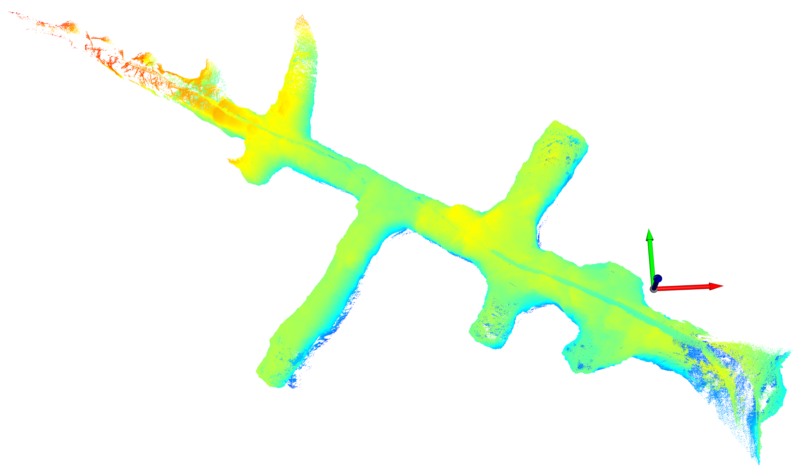
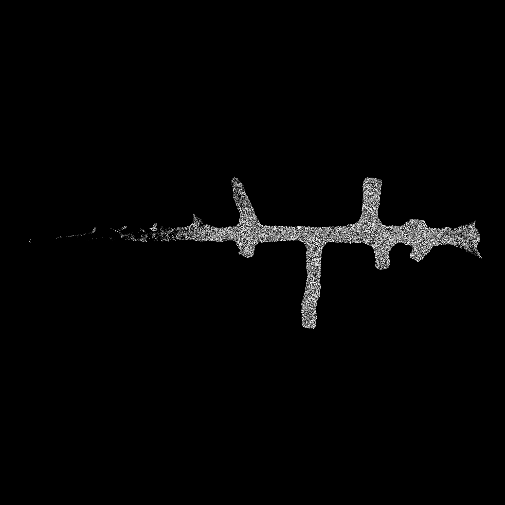
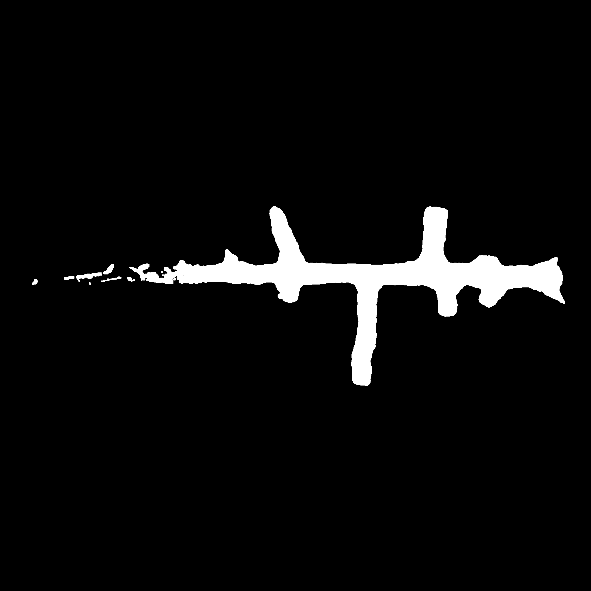
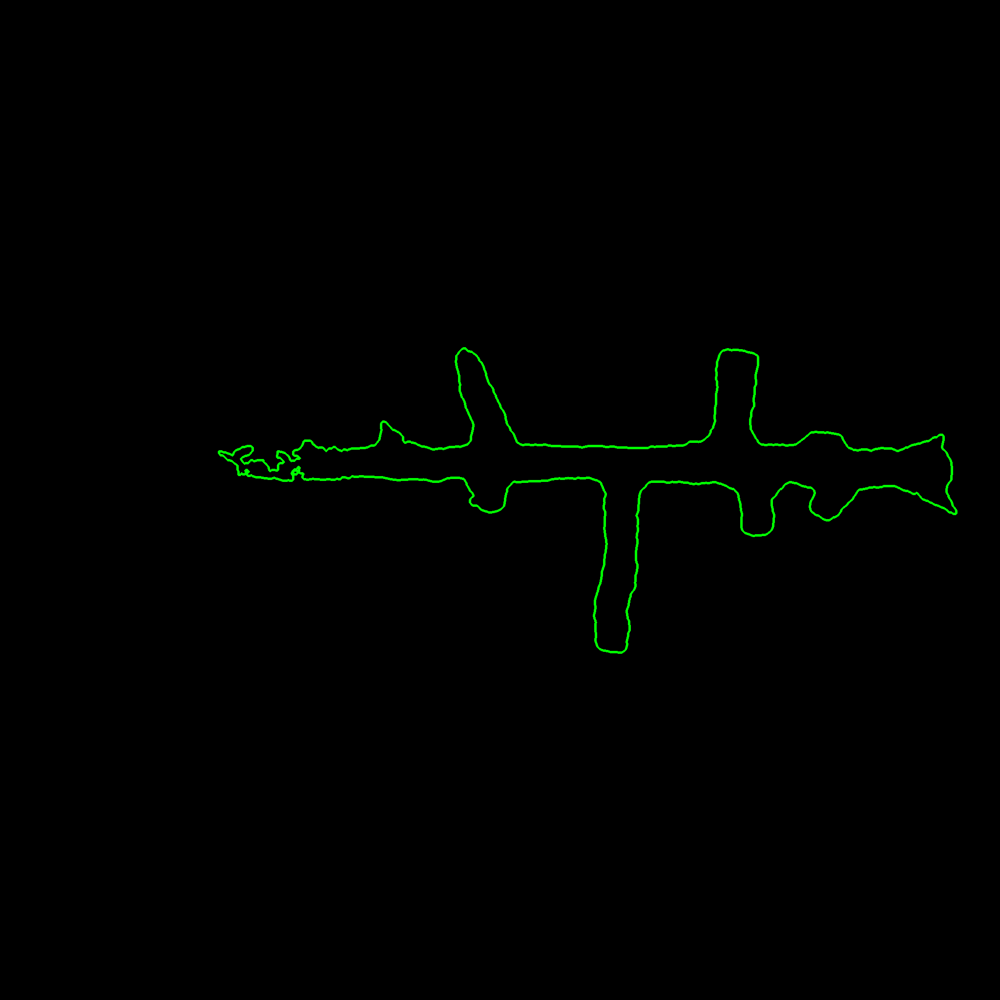

# Detect 2D drive profile from lidar point cloud
- Author: Yongzhi (Matt) Xu 
- Email: z5105843@zmail.unsw.edu.au 

## Installation 
```
conda env create --file=env.yaml
```

## Usage
```
conda activate drive_profile
python detect_drive_profile.py
```

## Overview
**Task:**  Detect 2D profile from 3D point cloud.  
**Assumption:** The point cloud has already been aligned with gravity.   
**Method:**  
- First, project the 3D point cloud into BEV density image. 
- Second, detect the contour from the BEV density image.
- Third, if necessary, the 2D contour can be lifted into 3D.
  
**Args:**    
- laz_path: path of input data
- out_dir: output directory
- sampling_ratio: Small sampling ratio enable fast detection but may result in inaccurate result if it is too small. 
- out_height:
- out_width: Larger output image size results in better result, but costs more time.

       
**Performance:**
- The detection taks about 9 seconds on a Macbook Pro with sampling ratio of 0.1 and image size of (2048,2048). The current version can be significantly improved in efficiency.    
- The criterion for accuracy is not well defined yet.

**Potential todo:**
- Fitting the detected contour to one single smooth and connected curve. 
- Improve the efficiency by simplify the pipeline and multi-processing. 
- Explore how to handle noisy and incomplete point cloud with more experiments.
- Explore more efficient and robust solution, such as forground mask segmentation, end-to-end curve detection.
- Incremental solution

## Experiments
(1) Input:   
       
         
(2) BEV density image:  
        
         
(3) BEV density image after histograms equalization:  
        
     
(4) Gaussian blur the image to overcome small holes in the point cloud (acturally not exist in this sample):  
        
     
(5) Binary image using a small threshold:  
        
     
(6) Erode and dilate the binary image to filter small isolated pieces. 
        
          
      
(7) Detect the contours as the final result:  
          
